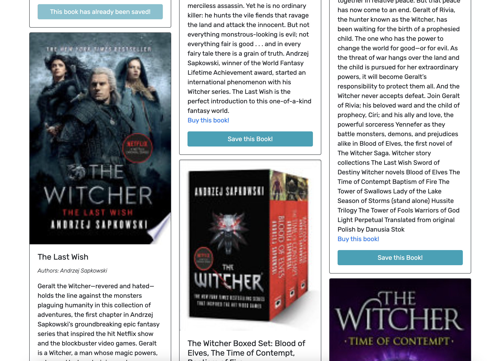
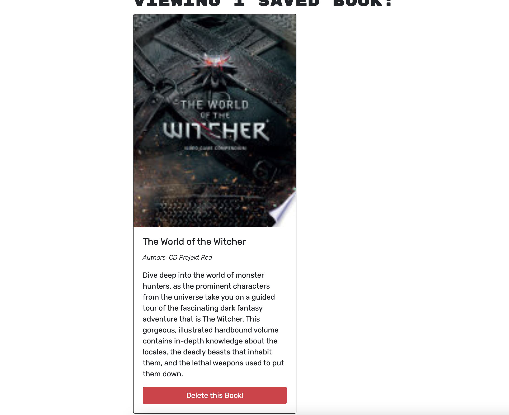

# Search for Books!
 
## Description
This is a fully functioning Google Books API search engine built using the MERN Stack, with a React front end, MongoDB database, and Node.js/Express.js server and API. Users are able to search for books using the google book API, once the results are populated, the user will have the opportunity to buy the book by clicking on the redirect link to google books. If the user is logged in, they are able to save and remove books from their account.

## Table of contents

* [Installation](#installation)
* [Usage](#usage)
* [License](#license)
* [Contributors](#contributors)
* [Questions](#questions)

## Installation
This application can be easily installed by cloning the repo and type "npm i" in the command line once you're in the root directory. Once it's finish installing type "npm start" to initalize the application. You will also require MongoDB if you don't have it installed. If not, follow the installation process on the MongoDB website.
        
## Usage
To use this application you can use the deployed link https://fathomless-island-71331.herokuapp.com/, install the application onto your local machine, or clone this repository and run it on the local port.

* Homepage
 
 
* Login
 
* SignUp
 
* Saved Books
 

## License
This application has the following licenses:
* [MIT License](https://choosealicense.com/licenses/mit/)

## Contributors
* https://github.com/coding-boot-camp/solid-broccoli
        

## Questions
If you have any questions feel free to contact me using the following sources:  
GitHub: [tonymengt](https://github.com/tonymengt)  
Email: [tonymengt@gmail.com](mailto:tonymengt@gmail.com)
